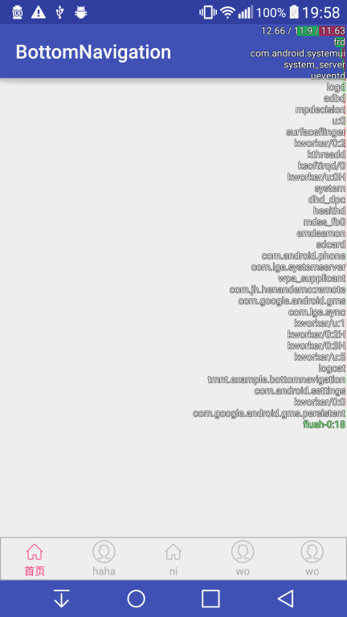

### 底部导航栏



1. 创建选项卡
    
      ```java
       TabItem tabItem3 = new TabItem.Builder(this)
                .setDefaultColor(0xFFACACAC)
                .setSelectColor(getResources().getColor(R.color.colorAccent))
                .setTest("wo")
                .setRes(R.drawable.lsv)
                .setTag("ja")
                .build();
      ```

2. 添加选项卡

   ```java
     Controller controller = mBottom.create()
                .addTabItem(tabItem)
                .addTabItem(tabItem1)
                .addTabItem(tabItem2)
                .addTabItem(tabItem3)
                .addTabItem(tabItem4)
                .build();
   ```

   Controller用于控制导航栏

3. 添加点击事件

   ```java
    controller.addTabItemClickListener(new OnTabItemSelectListener() {
            @Override
            public void onSelected(int index, Object tag) {
               
            }

            @Override
            public void onRepeatClick(int index, Object tag) {

            }
        });
   ```


